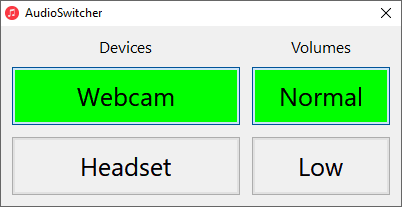

# AudioSwitcher

Quickly switch active audio devices for example from webcam & speakers to headset and back

## Configuration
The correct device-IDs have to be configured in audioswitcher.ini.

For the device-IDs start SoundVolumeView in the subdirectory SoundVolumeView, sort entries after column "Type" and go to the entries with "Type" = device,
click on the right mouse button, select "Properties" and then use the entry for "Command-Line Friendly ID".

## Download
Windows: 

## Third Party Inclusions
SoundVolumeView from NirSoft: https://www.nirsoft.net/utils/sound_volume_view.html \
Icon from Dtaf Alonso: https://www.iconarchive.com/show/yosemite-flat-icons-by-dtafalonso/Music-icon.html

## License and Copyright
This software is copyright (c) 2020 by alexgit2k.

This is free software, licensed under MIT License.
